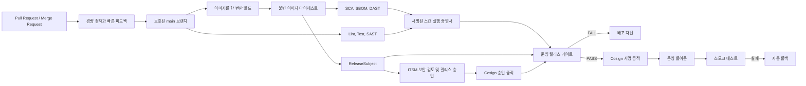

<p align="center">
  
</p>

# FinGuard: 온프레미스 DevSecOps 릴리스 게이트

[CI 실행 결과](https://github.com/kwakhyun/finguard-devsecops/actions)
[](https://www.python.org/)
[](LICENSE)

FinGuard는 서로 다른 품질 및 보안 보고서를 하나의 모델로 정규화하고, 검증을 마친 입력만으로 릴리스 가능 여부를 판정하는 Python 기반 릴리스 게이트입니다.
소스 커밋, 이미지 다이제스트, SBOM, 배포 대상을 `ReleaseSubject`로 묶습니다. 외부 변경 관리 승인과 스캔 실행 증명서가 같은 대상을 가리킬 때만 PASS 증적을 생성합니다.

예제 스캔 보고서와 샘플 서비스로 정책 판정과 배포 복구를 로컬에서 재현할 수 있습니다.

## 동작 예시

| 확인할 상황 | 기대 동작 | 재현 방법 |
| --- | --- | --- |
| 정상 입력과 위험한 변경 | 정상 입력은 PASS, 취약점과 승인 위반이 있는 변경은 종료 코드 2로 차단 | `./scripts/demo.sh` |
| 배포 중 SIGINT/SIGTERM | 변경 전 저장한 이미지와 감사 애너테이션 복원 후 중단 결과 기록 | `make integration-release` |
| 결과 서명 장애 | 이전 이미지로 복구하고 서명되지 않은 복구 기록 보존 | `make integration-release` |
| 같은 결과 경로의 동시 사용 | 두 번째 배포는 변경 전에 차단, 다른 작성자의 파일은 보존 | 배포 수명주기 회귀 테스트와 통합 테스트 |

Kubernetes 배포와 Cosign 서명 검증의 실행 방법은 [릴리스 통합 테스트 가이드](docs/integration-testing.md)를 참고하세요.

## 주요 기능

| 영역 | 구현 내용 |
| --- | --- |
| 릴리스 대상 결속 | 커밋, 한 번만 빌드한 이미지, SBOM, 클러스터, 네임스페이스, 워크로드, 상태 확인 URL을 하나의 불변 대상으로 검증 |
| 보안 테스트 | Semgrep/SARIF SAST, Trivy/CycloneDX SCA, SPDX 라이선스, OWASP ZAP DAST, VEX 처리 |
| 신뢰할 수 있는 판정 | 보고서 SHA-256, 스캐너, 규칙 세트, 허용된 명령어의 해시, 종료 코드, 러너, 서명, 취약점 DB 및 보고서의 최신성을 확인하고 검증에 실패하면 차단 |
| 변경 통제 | CB/SR, 직무분리, 최종 빌드 이후 승인, 전체 변경 요청 다이제스트에 결속된 ITSM Cosign 증적, 배포 허용 시간 및 증적 유효성 검증 |
| 감사 증적 | 평가 전 입력 스냅샷, 파일 매니페스트, 해시 체인 감사 로그, HMAC 또는 Cosign 서명, FinGuard 소유 표식 확인 후 증적을 원자적으로 교체 |
| 배포 안전성 | 정책 원문의 SHA-256을 대조하고 승인된 이미지 다이제스트로 Kubernetes에 배포, RBAC 사전 권한 검사, 결과 서명, 실패 시 이전 불변 이미지와 감사 애너테이션 복원 |
| 개발자 경험 | MR 전용 경량 정책, GitLab Code Quality, SARIF, 섀도 정책 비교, 빠른 로컬 피드백 |
| 운영 가시성 | 판정, 탐지 결과, 예외, VEX, OSS 인벤토리, 승인 증적 검증 지표를 Prometheus 형식으로 출력 |

## 로컬 재현

Python 3.11 이상에서 외부 보안 서버 없이 정책 판정을 실행하고 증적의 무결성을 검증할 수 있습니다.

```bash
python3 -m venv .venv
.venv/bin/pip install -r requirements-dev.lock
.venv/bin/pip install --no-deps -e .
make quality
./scripts/demo.sh
```

`pass` 시나리오는 실행 시각부터 1시간 동안 배포를 허용하도록 설정하고, 로컬 데모 전용 HMAC 키로 PASS 증적을 서명한 뒤 다시 검증합니다. 저장소에 공개된 데모용 키는 운영 환경에서 사용하면 안 됩니다. `fail` 시나리오는 `CRITICAL` 등급의 SCA 취약점, `HIGH` 등급의 SAST 위반, AGPL 라이선스, 테스트 실패, 직무분리 위반을 포함하며 의도한 종료 코드 `2`를 반환합니다.

실행을 마치면 정상 통과와 배포 차단 결과를 저장한 임시 디렉터리 경로를 출력합니다.

개발 중에는 표준 라이브러리만 사용하는 내장 스캐너로 빠르게 결과를 확인할 수 있습니다.

```bash
make scan
```

## 릴리스 흐름



GitLab과 Jenkins 파이프라인은 변경 검증과 운영 릴리스의 신뢰 경계를 분리합니다. DAST 잡은 자신의 Podman 저장소에 대상 이미지와 ZAP 이미지를 다이제스트로 내려받은 뒤 실행합니다. GitLab 레지스트리 인증 파일은 잡 전용 임시 디렉터리에 만들고 이미지 준비 후 제거합니다. 운영 배포 잡은 `interruptible: false`로 중복 파이프라인 자동 취소를 막습니다.
변경 검증 작업에는 변경 승인 증적, 서명 키, Kubernetes 자격 증명을 제공하지 않습니다.
릴리스 경로에서는 루트 권한이 필요 없는 BuildKit 또는 Podman으로 이미지를 한 번만 빌드합니다. 이후 레지스트리가 반환한 동일한 다이제스트를 SCA, DAST, 승인, 배포에 재사용합니다.

## 정책 판정

`financial-baseline.toml`은 로컬 데모에서 전체 통제를 재현하는 정책이고, `financial-release.toml`은 보호된 러너에서 사용하는 엄격한 정책입니다. 릴리스 정책은 다음 항목을 추가로 요구합니다.

- 모든 보고서에 서명된 스캔 실행 증명서가 있고 러너와 서명 키 ID가 허용 목록에 포함될 것
- 40자 또는 64자의 축약하지 않은 소스 커밋 해시가 정확히 일치하고 SCA/DAST 이미지 다이제스트도 일치할 것
- CycloneDX 보고서의 SHA-256과 승인된 SBOM의 SHA-256이 일치할 것
- 스캐너 명령어 및 규칙 세트의 해시, 종료 코드, 취약점 DB 해시와 갱신 시각이 유효할 것
- 최소 테스트 수를 충족하고 JUnit 선언 건수와 실제 테스트 케이스 수, 커버리지 비율과 원시 집계값이 일관될 것
- 최종 빌드 이후에 보안 및 릴리스 승인을 각각 받을 것
- ITSM 발급자와 Cosign 키 ID가 허용 목록에 포함되고, 전체 `ChangeRequest` 및 `ReleaseSubject` 다이제스트가 일치할 것

탐지 결과의 지문(fingerprint)에는 스캐너 제품명과 메시지를 넣지 않습니다. 대신 범주, 규칙 또는 CVE, 구성 요소, 대소문자를 보존한 위치나 설치 버전을 사용합니다. 따라서 도구가 바뀌어도 같은 이슈를 식별해 중복을 제거할 수 있습니다.

이미 확인된 심각도를 `UNKNOWN` 관측값으로 덮지 않으며, 동일한 패키지라도 버전이 다른 라이선스 항목은 합치지 않습니다. OSS 라이선스는 SPDX의 `AND`, `OR`, `WITH` 표현식을 의미에 맞게 평가하고 잘못된 표현식은 통과시키지 않습니다.

## 운영 서명 경계

로컬 재현에서는 추가 의존성 없이 HMAC 서명을 사용할 수 있습니다. 운영 CI는 다음과 같이 신뢰 경계를 분리합니다.

- ITSM은 개인키로 승인 페이로드를 서명하고, CI는 공개키만 보유합니다.
- 게이트 작업만 KMS 또는 Vault의 Cosign 서명 URI에 접근해 최종 증적을 서명합니다.
- 배포 러너는 PASS 증적을 공개키로 검증하며, PASS 증적을 서명할 권한은 갖지 않습니다. `--require-signature`는 필수입니다.
- 실제 배포에서는 별도 KMS 또는 Vault URI로 결과 JSON까지 서명해야 합니다. 서명 키가 없으면 Kubernetes를 변경하지 않습니다. Cosign 번들은 임시 파일에서 완성한 뒤 원자적으로 게시하므로, 서명에 실패한 불완전한 파일을 감사 결과로 남기지 않습니다.

GitLab에서는 ITSM 승인 파일, Cosign 공개키, 증적 서명 키를 보호 변수로 관리합니다. 스캔 서명 키와 Kubernetes 자격 증명도 운영 릴리스 러너에만 제공합니다.

내부 레지스트리의 BuildKit, Semgrep, Trivy, DAST 러너, ZAP 이미지는 다이제스트로 고정하고 실제 도구 버전을 CI 변수에 명시합니다. 보호 변수와 CI 연결 방식은 [GitLab 파이프라인](.gitlab-ci.yml), 장애 대응 절차는 [운영 런북](docs/operations-runbook.md)에서 확인할 수 있습니다.

## 배포 예시

다음 명령은 증적과 배포 요청이 일치하는지 확인한 뒤 배포 계획 파일을 만듭니다. 클러스터는 변경하지 않습니다.

```bash
make demo-pass
.venv/bin/python -m finguard deploy \
  --cluster onprem-prod-01 \
  --namespace credit-prod \
  --deployment customer-credit-api \
  --container api \
  --image registry.example/credit/api@sha256:aaaaaaaaaaaaaaaaaaaaaaaaaaaaaaaaaaaaaaaaaaaaaaaaaaaaaaaaaaaaaaaa \
  --expected-policy-id FIN-SW-DEVSECOPS-BASELINE \
  --expected-policy-version 5.1.1 \
  --expected-policy-sha256 20f198a2be733c2d2bccb963952eade70d225391a6dbe79375a5fe3c81a1e7ab \
  --evidence build/demo-evidence/pass \
  --output build/deployment-plan.json \
  --allow-unsigned \
  --dry-run
```

`make demo-pass`는 이 예시에서 사용할 증적을 `build/demo-evidence/pass`에 생성합니다. `--allow-unsigned`는 로컬 `--dry-run` 시연에서만 허용되며, 실제 배포에서는 사용할 수 없습니다.

실제 배포에서는 서명된 PASS 증적으로 직무분리와 품질 기준의 충족 여부를 확인합니다. 정책 ID와 버전, 정책 파일 SHA-256, 변경 ID, 이미지, 클러스터, 워크로드, 배포 허용 시간, 증적 평가 시각도 다시 대조합니다.

검증을 시작하기 전에 증적 디렉터리를 전용 스냅샷으로 복사해 검증 중 입력이 바뀌지 않도록 합니다. 증적 평가 시각도 검사해 유효 기간이 지났거나 미래 시각인 증적은 거부합니다.

롤아웃, 스모크 테스트 또는 배포 결과 서명에 실패하면 배포 직전에 확인한 이전 이미지 다이제스트와 FinGuard 감사 애너테이션을 복원합니다. 실제 배포에는 `--result-cosign-signing-key`가 필요합니다. 결과 JSON과 서명 파일의 경로를 다른 작업이 동시에 사용하지 못하도록 예약하고, 서명을 준비한 뒤 JSON을 마지막에 게시합니다. 다른 작업이 같은 경로에 파일을 먼저 생성하면 해당 파일을 보존하고 배포를 되돌립니다. 변경 전에는 `<결과 경로>.recovery.json`에 이전 이미지와 감사 애너테이션을 저장합니다. 이 파일은 서명된 최종 결과와 별도로 보관하는 로컬 복구 기록입니다.

## 온프레미스 예시

SonarQube와 PostgreSQL 예시에서도 버전이 바뀔 수 있는 이미지 태그를 사용하지 않습니다. `make onprem-up`은 두 이미지가 다이제스트로 고정됐는지 확인하고, 지정된 Cosign 공개키로 서명을 검증한 뒤 Compose를 실행합니다. 다이제스트 또는 서명 검증에 실패하면 인프라를 시작하지 않습니다.

```bash
export POSTGRES_IMAGE='registry.internal/postgres@sha256:<64-hex>'
export SONARQUBE_IMAGE='registry.internal/sonarqube@sha256:<64-hex>'
export FINGUARD_TOOL_IMAGE_COSIGN_PUBLIC_KEY='/run/secrets/tool-image-cosign.pub'
export SONAR_DB_PASSWORD='<secret-store-injected-value>'
make onprem-up
```

## 저장소 구성

```text
finguard/                 CLI, 정규화, 정책, 스캔 실행 증명서, 증적, 배포
finguard/checks/          품질, 출처, 변경 승인, 예외 및 VEX 검사
policies/                 변경 검증, 로컬 기준, 운영 릴리스 정책과 예외 예시
.semgrep/                 Python Secure Coding 규칙
examples/scenarios/       재현 가능한 PASS와 FAIL 입력
sample_service/           DAST와 스모크 테스트용 최소 HTTP 서비스
tests/                    정책, 파서, 신뢰 경계, 무결성, 롤백 테스트
infra/                    온프레미스 SonarQube 구성 예시
docs/                     설계, 통제 매핑, 변경 관리 흐름, 런북, 로드맵
scripts/                  데모와 CI 보조 도구
.gitlab-ci.yml            GitLab MR과 릴리스 파이프라인
Jenkinsfile               같은 통제를 구현한 Jenkins 파이프라인
```

## 입력 제한

`gate`, `verify`, `deploy`는 입력을 비공개 스냅샷으로 복사하면서 파일당 50 MiB, 명령당 합계 512 MiB, 최대 2,048개 항목을 허용합니다. 증적 디렉터리는 하위 디렉터리도 항목 수에 포함합니다. 복사 중 파일이 커지거나 제한을 넘으면 종료 코드 3으로 중단하고, 심볼릭 링크를 비롯해 일반 파일이 아닌 입력도 거부합니다. 입력을 자동으로 잘라서 판정하지 않습니다.

## 테스트

`make quality`는 Ruff, Mypy와 테스트를 실행하며 최소 커버리지 85%를 요구합니다. JUnit, 커버리지 XML, Ruff JSON 보고서를 `build/quality-reports/`에 남깁니다. `QUALITY_REPORT_DIR`로 출력 위치를 바꿀 수 있습니다. 별도 실행하는 `./scripts/demo.sh`는 테스트를 포함하며, 품질 검사를 이미 마쳤다면 `./scripts/demo.sh --skip-tests`로 데모만 실행할 수 있습니다.

[GitHub Actions](https://github.com/kwakhyun/finguard-devsecops/actions)는 품질 검사와 함께 Semgrep, Trivy, OWASP ZAP을 실행합니다. 별도 통합 테스트는 임시 kind 클러스터, 로컬 레지스트리와 Cosign으로 배포, 복구와 결과 서명을 검증합니다.

## 자세한 문서

- [아키텍처와 위협 모델](docs/architecture.md)
- [DevOps 통제 구현과 검증](docs/control-mapping.md)
- [Git 기반 CB/SR 변경 관리 흐름](docs/changeflow.md)
- [운영과 장애 대응 런북](docs/operations-runbook.md)
- [사용 예제와 검증 가이드](docs/demo-guide.md)
- [개발 및 기여 안내](CONTRIBUTING.md)
- [보안 정책](SECURITY.md)

## 지원 범위와 제약 사항

- 핵심 로직은 Python 3.11 표준 라이브러리만 사용합니다.
- 정책 판정과 배포 통합 테스트에는 예제 보고서와 승인 입력을 사용합니다. 실제 조직의 ITSM, IdP, KMS와 온프레미스 운영 환경을 연결한 검증은 포함하지 않습니다.
- Coverity와 SonarQube에서 내보낸 SARIF 결과를 읽을 수 있으며, 상용 서버 API와의 직접 연동은 지원하지 않습니다.
- FOSSA 제품 연동은 지원하지 않습니다. OSS 취약점과 라이선스 검사는 Trivy, CycloneDX, SPDX 입력으로 처리합니다.
- 실제 도입 시 외부 승인 및 서명 시스템 연동, 증적 보존과 SIEM 전송, 데이터베이스 마이그레이션 통제를 환경에 맞게 추가해야 합니다.

## 라이선스

MIT 라이선스입니다. 자세한 내용은 [LICENSE](LICENSE)를 확인하세요.
