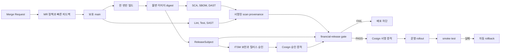

# FinGuard: 온프레미스 DevSecOps 릴리스 게이트

[](https://github.com/kwakhyun/finguard-devsecops/actions/workflows/portfolio-ci.yml)
[](https://www.python.org/)
[](LICENSE)

FinGuard는 서로 다른 품질과 보안 리포트를 하나의 모델로 정규화하고, 검증한 입력만으로 릴리스 가능 여부를 판정하는 Python 기반 자동화 프로젝트입니다.
소스 커밋, 이미지 digest, SBOM, 배포 대상을 `ReleaseSubject`로 묶고, 외부 변경관리 승인과 스캔 증적이 그 대상과 일치할 때만 PASS 증적을 생성합니다.

이 저장소는 채용 지원을 위해 설계한 독립 포트폴리오입니다. 합성 스캔 리포트와 샘플 서비스를 사용했으며, 실제 금융사 운영 경험이나 규제 준수 인증을 주장하지 않습니다.

## 프로젝트 정보

- 개발자: [@kwakhyun](https://github.com/kwakhyun)
- 개발 형태: 개인 프로젝트
- 기여도: 100% — 기획, 아키텍처, Python 구현, 정책, CI/CD, 테스트, 문서화
- 빠른 검토: [1페이지 포트폴리오 요약](PORTFOLIO.md)
- 공개 검증: [GitHub Actions 실행 이력](https://github.com/kwakhyun/finguard-devsecops/actions/workflows/portfolio-ci.yml)

## 핵심 결과

| 영역 | 현재 구현 |
| --- | --- |
| 릴리스 결속 | commit, 단일 빌드 이미지, SBOM, cluster, namespace, workload, health URL을 하나의 불변 대상으로 검증 |
| 보안 테스트 | Semgrep/SARIF SAST, Trivy/CycloneDX SCA, SPDX 라이선스, OWASP ZAP DAST, VEX 처리 |
| 신뢰할 수 있는 판정 | 리포트 SHA-256, scanner, ruleset, 허용 command hash, 종료 코드, Runner, 서명, DB와 리포트 신선도를 fail-closed로 확인 |
| 변경 통제 | CB/SR, 직무분리, 최종 빌드 후 승인, 전체 변경 요청 digest에 묶인 ITSM Cosign 증적, 배포 시간 창구와 증적 신선도 검증 |
| 감사 증적 | 평가 전 입력 snapshot, 파일 manifest, hash-chain audit log, HMAC 또는 Cosign 서명, 소유 표식 기반 안전한 교체 |
| 배포 안전성 | 승인된 정책 원문의 SHA-256와 이미지 digest만 Kubernetes에 배포, RBAC preflight, 서명된 결과, 실패 시 이전 불변 이미지와 감사 annotation 복원 |
| 개발자 경험 | MR 전용 경량 정책, GitLab Code Quality, SARIF, shadow policy 비교, 로컬 즉시 피드백 |
| 운영 가시성 | Prometheus text format으로 판정, 이슈, 예외, VEX, OSS inventory, 승인 서명 지표 export |

## 3분 재현

Python 3.11 이상에서 외부 보안 서버 없이 정책 판정과 증적 무결성을 재현할 수 있습니다.

```bash
python3 -m venv .venv
.venv/bin/pip install -r requirements-dev.lock
.venv/bin/pip install --no-deps -e .
make quality
./scripts/demo.sh
```

`pass` 시나리오는 로컬 데모 전용 HMAC 키로 PASS 증적을 서명하고 다시 검증합니다. 저장소에 공개된 이 데모용 값은 운영에 사용하면 안 됩니다. `fail` 시나리오는 Critical SCA, High SAST, AGPL, 테스트 실패, 직무분리 위반을 포함하며 의도한 종료 코드 `2`를 반환합니다.

개발 중 빠른 피드백은 표준 라이브러리만 사용하는 내장 scanner로 확인합니다.

```bash
.venv/bin/python -m finguard scan source --workspace . --output build/reports/native
.venv/bin/python -m finguard scan lint --workspace . --output build/reports/native
.venv/bin/python -m finguard scan dependencies --workspace . --output build/reports/native
```

## 릴리스 흐름



GitLab과 Jenkins 모두 MR과 보호 릴리스의 신뢰 경계를 나눉니다.
MR job에는 변경 승인, 서명, Kubernetes 자격 증명을 주입하지 않습니다.
릴리스 경로는 rootless BuildKit 또는 Podman으로 이미지를 한 번만 빌드하고, 등록소가 반환한 같은 digest를 SCA, DAST, 승인, 배포에 재사용합니다.

## 정책 판정

`financial-baseline.toml`은 로컬 데모용 완전 기준이고, `financial-release.toml`은 보호 Runner에서 사용하는 엄격한 기준입니다. 릴리스 정책은 다음을 추가로 요구합니다.

- 모든 리포트의 서명된 provenance와 허용된 Runner, signer key ID
- 전체 40자 또는 64자 source commit의 정확한 일치와 SCA/DAST 이미지 digest 일치
- CycloneDX 리포트 SHA-256와 승인된 SBOM SHA-256 일치
- scanner command hash와 종료 코드, ruleset hash, 취약점 DB hash 및 갱신 시각 검증
- 최소 테스트 수, JUnit 선언값과 testcase 실측값, coverage 비율과 원시 count의 일관성
- 최종 빌드 이후의 독립된 보안, 릴리스 승인
- ITSM 발급자, Cosign key ID, 전체 `ChangeRequest` digest와 `ReleaseSubject` digest 일치

Finding fingerprint는 scanner 제품명과 메시지를 제외합니다. 대신 category, 규칙/CVE, component, 대소문자를 보존한 위치 또는 설치 버전을 사용해 도구가 바뀌어도 같은 이슈를 중복 제거합니다. 알려진 심각도를 `UNKNOWN` 관측값으로 덮지 않으며, 서로 다른 라이선스 버전도 합치지 않습니다. OSS 라이선스는 SPDX `AND`, `OR`, `WITH` 표현식을 의미에 맞게 평가하고, 잘못된 표현식은 통과시키지 않습니다.

## 운영 서명 경계

로컬 데모는 추가 의존성 없이 재현하기 위해 HMAC을 선택할 수 있습니다. 운영 CI는 다른 경계를 사용합니다.

- ITSM이 개인키로 승인 payload를 서명하고 CI는 공개키만 가집니다.
- 게이트 job만 KMS/Vault Cosign signing URI에 접근해 최종 증적을 서명합니다.
- 배포 Runner는 증적 공개키만 보유하며 `--require-signature`를 우회할 수 없습니다.
- 실제 배포는 별도 KMS 또는 Vault URI로 결과 JSON까지 서명해야 하며, 서명 키가 없으면 Kubernetes를 변경하지 않습니다. Cosign bundle은 임시 파일에 완성한 뒤 원자적으로 게시하므로 실패한 부분 파일을 감사 결과로 남기지 않습니다.

GitLab에서는 `APPROVAL_ATTESTATION_PATH`, `APPROVAL_ATTESTATION_BUNDLE_PATH`, `FINGUARD_APPROVAL_COSIGN_PUBLIC_KEY`, `FINGUARD_EVIDENCE_COSIGN_SIGNING_KEY`, `FINGUARD_EVIDENCE_COSIGN_PUBLIC_KEY`를 보호 변수로 관리합니다.
스캔 서명 키와 Kubernetes 자격 증명도 보호 릴리스 Runner에만 제공합니다. 내부 registry의 BuildKit, Semgrep, Trivy, DAST Runner, ZAP 이미지 digest와 실제 도구 버전도 그룹 변수로 명시해야 합니다.

## 배포 예시

다음 명령은 증적과 요청이 일치하는지 확인하고 클러스터에 쓰지 않는 계획 파일만 만듭니다.

```bash
.venv/bin/python -m finguard deploy \
  --cluster onprem-prod-01 \
  --namespace credit-prod \
  --deployment customer-credit-api \
  --container api \
  --image registry.example/credit/api@sha256:aaaaaaaaaaaaaaaaaaaaaaaaaaaaaaaaaaaaaaaaaaaaaaaaaaaaaaaaaaaaaaaa \
  --expected-policy-id FIN-SW-DEVSECOPS-BASELINE \
  --expected-policy-version 5.1.0 \
  --expected-policy-sha256 9698166a28a0530adbc5672aadc53ecc84f4f1ee0e6b0ee4fad937e91b978d7b \
  --evidence build/demo-evidence/pass \
  --output build/deployment-plan.json \
  --allow-unsigned \
  --dry-run
```

실제 배포는 서명된 PASS 증적으로 직무분리와 품질 통제가 통과했음을 확인합니다. 이어서 정책 ID, 버전, 정책 파일 SHA-256, 변경 ID, 이미지와 클러스터 및 workload, 배포 창구, 증적 평가 시각을 다시 대조합니다. 증적 디렉터리도 검증 전에 전용 snapshot으로 고정합니다. 오래됐거나 미래 시각인 증적은 재사용할 수 없습니다. rollout, smoke test 또는 배포 결과 서명이 실패하면 배포 전에 읽어 둔 정확한 이전 이미지 digest와 기존 FinGuard 감사 annotation을 복원합니다. 실제 배포에는 `--result-cosign-signing-key`가 필수이고, 결과 파일은 기본적으로 기존 파일을 덮어쓰지 않습니다.

## 온프레미스 예시

SonarQube와 PostgreSQL 예시도 부동 태그를 사용하지 않습니다. 내부 registry에 반입하고 서명을 검증한 digest 참조를 설정한 뒤 wrapper를 통해 시작합니다.

```bash
export POSTGRES_IMAGE='registry.internal/postgres@sha256:<64-hex>'
export SONARQUBE_IMAGE='registry.internal/sonarqube@sha256:<64-hex>'
export SONAR_DB_PASSWORD='<secret-store-injected-value>'
make onprem-up
```

## 저장소 구성

```text
finguard/                 CLI, 정규화, 정책, provenance, 증적, 배포
policies/                 MR, baseline, 보호 릴리스 정책과 예외 예시
.semgrep/                 Python Secure Coding 규칙
examples/scenarios/       재현 가능한 PASS와 FAIL 입력
sample_service/           DAST와 smoke test용 최소 HTTP 서비스
tests/                    정책, parser, 신뢰 경계, 무결성, rollback 테스트
infra/                    온프레미스 SonarQube 구성 예시
docs/                     설계, 통제 매핑, ChangeFlow, 런북, 로드맵
.gitlab-ci.yml            GitLab MR과 릴리스 파이프라인
Jenkinsfile               Jenkins 동일 통제 파이프라인
```

## 자세한 문서

- [아키텍처와 위협 모델](docs/architecture.md)
- [DevOps 역량과 통제 구현 매핑](docs/control-mapping.md)
- [Git 및 CB/SR ChangeFlow](docs/changeflow.md)
- [운영과 장애 대응 런북](docs/operations-runbook.md)
- [면접 시연 가이드](docs/portfolio-guide.md)
- [단계별 개선 이력과 다음 로드맵](docs/roadmap.md)

## 검증한 범위와 남은 한계

- 코어 로직은 Python 3.11 표준 라이브러리만 사용하고 단위 및 통합 테스트로 검증했습니다.
- 현재 회귀 테스트는 190개이며 Ruff, Mypy, 85% 이상 coverage 기준과 함께 실행합니다.
- 공개 GitHub Actions는 Semgrep, Trivy, OWASP ZAP을 실제 실행하고 결과를 같은 정책 게이트로 판정합니다.
  Cosign과 kubectl은 CI adapter 및 subprocess 계약 테스트로 검증했으며, 실제 온프레미스 서버나 Kubernetes cluster를 기동한 실적은 아닙니다.
- generic SARIF adapter로 Coverity와 SonarQube export를 읽을 수 있지만 상용 서버 API와 직접 통합하지는 않았습니다.
- FOSSA 제품 실행은 검증 범위에 포함하지 않았습니다. 대신 Trivy, CycloneDX, SPDX 정책으로 OSS 관리 경계가 작동하도록 구성했습니다.
- 실제 도입 시 ITSM과 IdP API, workload identity 기반 scanner 서명, 서명된 정책 bundle, WORM 증적 저장소, SIEM 전송, 데이터베이스 migration 통제를 추가해야 합니다.

## 라이선스

MIT License. 자세한 내용은 [LICENSE](LICENSE)를 확인하세요.
